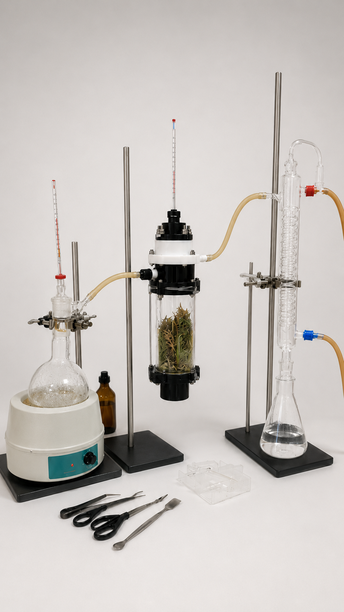

# CREATIBIO - Desarrollo de Bioactivos y Tecnologías de Extracción

Repositorio correspondiente a la línea de Desarrollo de Bioactivos y Tecnologías de Extracción de CREATIBIO.

Esta línea se enfoca en la obtención, procesamiento y documentación de extractos vegetales, aceites esenciales y compuestos bioactivos de interés biotecnológico, farmacéutico y educativo.

La línea puede articularse con Tecnologías Aplicadas al Agro, utilizando material vegetal producido en sistemas de cultivo automatizado.

## Proyectos

### Extracción de compuestos bioactivos vegetales

Diseño y aplicación de métodos de extracción para la obtención de compuestos de interés a partir de material vegetal.

### Destilación de aceites esenciales

Desarrollo de sistemas de destilación y obtención de aceites esenciales con fines educativos y experimentales.

### Aromas y productos naturales

Exploración de aplicaciones vinculadas a formulación, caracterización y uso de productos naturales.

## Contenido del repositorio

- Protocolos de extracción
- Diseños de equipos
- Documentación técnica
- Registros experimentales
- Material de apoyo
- Imágenes y prototipos proyectados

## Capacidades involucradas

- Química orgánica
- Farmacognosia
- Productos naturales
- Técnicas de extracción
- Destilación
- Diseño experimental
- Documentación reproducible

## Prototipo proyectado

## Organización

Responsable de línea:
- Álvaro Jovic

Dirección general:
- Galo Balatti

CREATIBIO – IUDPT
